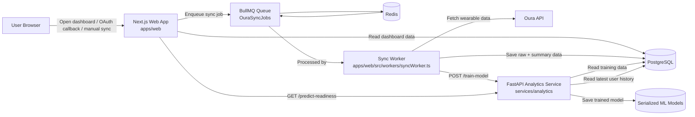
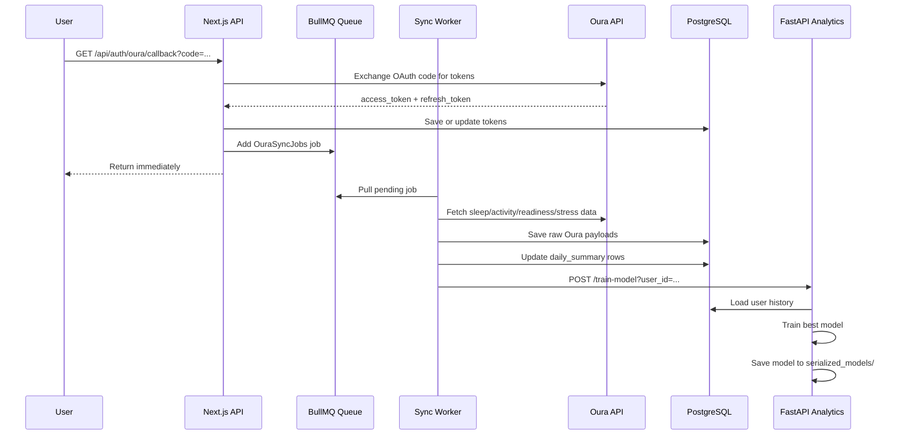
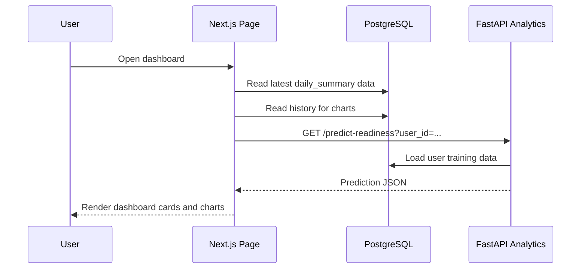
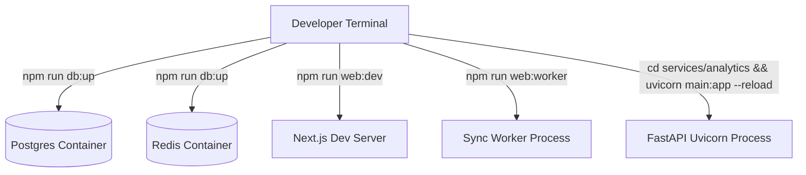

# Architecture

This document explains how the current system works after the refactor changes that have already been implemented.

## Refactor Status

- [x] Part 2: Separate environment variables and service configs
- [ ] Part 3: Not implemented in this repo yet
- [x] Part 4: Asynchronous Oura ingestion with BullMQ

## High-Level Architecture

## Main Runtime Flow

## Dashboard Flow

## Folder Roles

- `apps/web`: Next.js UI, API routes, queue setup, and background worker.
- `services/analytics`: FastAPI ML service.
- `infra/postgres`: database bootstrap SQL for local development.
- `packages/db`: schema snapshot and DB-related assets.
- `docs`: architecture and project-level documentation.

## Local Processes

## Mental Model

1. The web app is the UI and HTTP entrypoint.
2. PostgreSQL is the source of truth.
3. Redis is only used for background job queueing.
4. The worker handles slow Oura sync work.
5. The analytics service handles training and prediction.
6. The dashboard reads from PostgreSQL and asks analytics for ML output.
