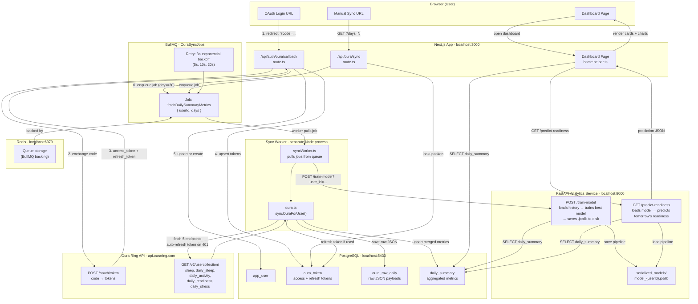
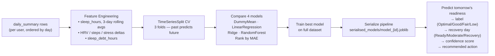

# System Diagram

## Components and Data Flows



---

## Two Key Flows at a Glance

### Flow 1 — OAuth + Initial Sync

```
Browser
  → GET /api/auth/oura/callback?code=...
    → Exchange code with Oura → save tokens to DB
    → Enqueue BullMQ job (days=30)
    → Return 200 immediately

Worker (background)
  → Pull job from Redis queue
  → Fetch 5 Oura endpoints (sleep, readiness, activity, stress)
  → Save raw + summarised data to Postgres
  → POST /train-model to Analytics service

Analytics
  → Load daily_summary from Postgres
  → Cross-validate 4 models with TimeSeriesSplit
  → Train winner on full data
  → Serialize pipeline to disk as model_{userId}.joblib
```

### Flow 2 — Dashboard Render

```
Browser → Dashboard page
  → Next.js reads daily_summary from Postgres (charts, cards)
  → Next.js calls GET /predict-readiness on Analytics service
    → Analytics loads saved model from disk
    → Predicts tomorrow's readiness score (0–100)
    → Returns label, confidence, recommended action, reason
  → Page renders with both historical data + ML prediction
```

---

## ML Model Detail

